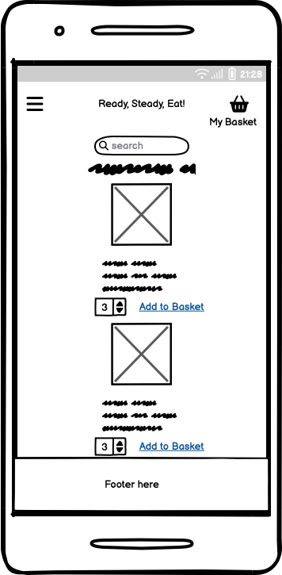
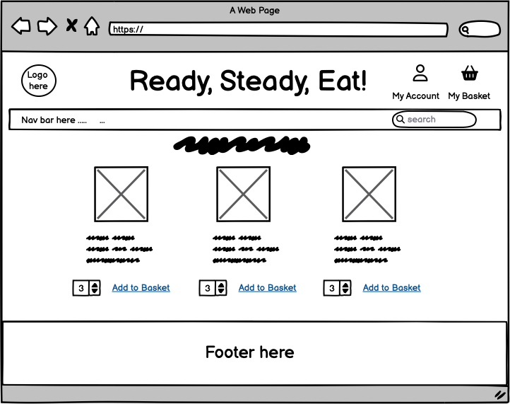
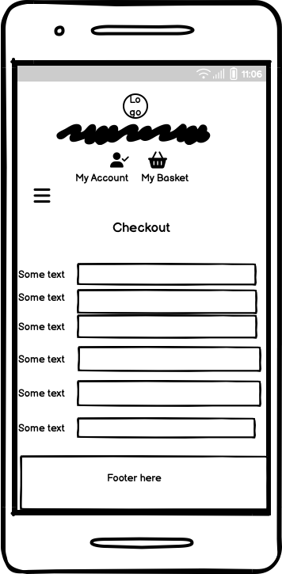
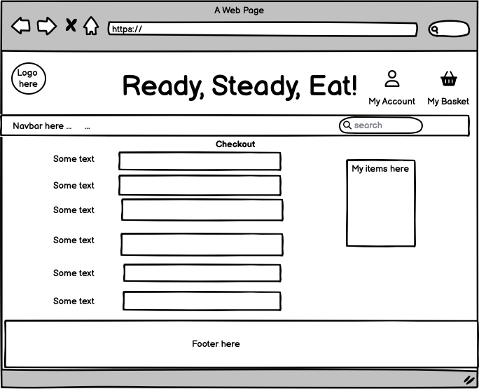

# Online Food Shop Project (Milestone 4)
 
 An online food shop that sells meals and fresh food products.

 # UX

 ## User stories

 ### Registration and Login
 - As a user, I should be able to easily register for an account, so I have a personal account and their profile.
 - As a user, I should be able to log in to my account, so that I can see the relevant information on my account.
 - As a user, I should be able to log out of my account to keep my account safe and secure.
 - As a user, I should receive a confirmation email after registering to confirm that my registration went through and was succesful.
 - As a user, if I forget my password I should easily be able to recover it, so I am able to access my account again and log in.
 - As a user, I should have a personalised profile so I can have access to my personal information, my orders, and update payment information.

 ### Food/Meal Products and Checkout
- As a shopper, I should be able to view a list of my products and on the relevant pages, so I see the items and purchase them.
- As a shopper, I should be able to view the product details of each product, so that I see further information about it such as the name, image, dietary/cooking requirements symbols, and description.
- As a shopper, I should be able to search and filter the various meals/food in the search bar, so it can help me to find items that are relevant to what I am looking for.
- As a shopper, I should be able to see the total of items that are added to my cart so I can see how much my order costs.
- As a shopper, I should be able to add and remove items from my cart, so I can amend items I need to when I add it to an order.
- As a shopper, I should be able to edit quantity of items that are in my basket before I pay, so I can order the right amount of products that I need.
- As a shopper, I expect the payment to go through succesfully without any errors, so that I can purchase what is in my basket.

### Other/General
- As a user, it should be clear what the purpose of the website is, what it is about, and what content is in it, so I can decide if I want to explore and view the website further.
- As a user, I should be able to easy navigate across the website, to improve the user experience, so I find the information easily that I am looking for.
- As a user, I expect the website to be responsive on different screen sizes on mobile, tablet, and desktop, so I can view everything easily on the website.
- As a user, I want be able to see the FAQ page, so I can find out the relevant information to any queries or general information that I may need.
- As a user, I want to be able contact the company on the contact us page, so I can request inforamtion that I need or ask general queries.
- As a user, I want to be able to view various offers and subscriptions listed on the home page, so I can decide whether to go ahead with using any of them before I purchase any items.

## Wireframes 
### Products Page - Mobile

### Products Page - Desktop

### Product Details Page - Mobile

### Product Details Page - Desktop

### Checkout Page - Mobile

### Checkout Page - Desktop
