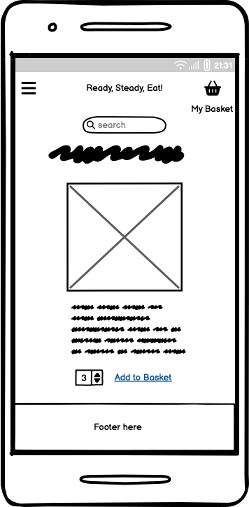
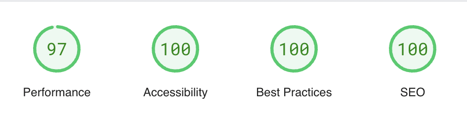

# Online Food Shop Project (Milestone 4)
 
 An online food shop called Ready, Steady, Eat! that sells meals and fresh food products.

 # UX

 ## User stories

 ### Registration and Login
 - As a user, I should be able to easily register for an account, so I have a personal account and their profile.
 - As a user, I should be able to log in to my account, so that I can see the relevant information on my account.
 - As a user, I should be able to log out of my account to keep my account safe and secure.
 - As a user, I should receive a confirmation email after registering to confirm that my registration went through and was succesful.
 - As a user, if I forget my password I should easily be able to recover it, so I am able to access my account again and log in.
 - As a user, I should have a personalised profile so I can have access to my personal information, my orders, and update payment information.

 ### Food/Meal Products and Checkout
- As a shopper, I should be able to view a list of my products and on the relevant pages, so I see the items and purchase them.
- As a shopper, I should be able to view the product details of each product, so that I see further information about it such as the name, image, dietary/cooking requirements symbols, and description.
- As a shopper, I should be able to search and filter the various meals/food in the search bar, so it can help me to find items that are relevant to what I am looking for.
- As a shopper, I should be able to see the total of items that are added to my cart so I can see how much my order costs.
- As a shopper, I should be able to add and remove items from my cart, so I can amend items I need to when I add it to an order.
- As a shopper, I should be able to edit quantity of items that are in my basket before I pay, so I can order the right amount of products that I need.
- As a shopper, I expect the payment to go through succesfully without any errors, so that I can purchase what is in my basket.

### Other/General
- As a user, it should be clear what the purpose of the website is, what it is about, and what content is in it, so I can decide if I want to explore and view the website further.
- As a user, I should be able to easy navigate across the website, to improve the user experience, so I find the information easily that I am looking for.
- As a user, I expect the website to be responsive on different screen sizes on mobile, tablet, and desktop, so I can view everything easily on the website.
- As a user, I want be able to see the FAQ page, so I can find out the relevant information to any queries or general information that I may need.
- As a user, I want to be able contact the company on the contact us page, so I can request inforamtion that I need or ask general queries.
- As a user, I want to be able to view various offers and subscriptions listed on the home page, so I can decide whether to go ahead with using any of them before I purchase any items.

## Wireframes 
### Home Page - Mobile

### Home Page - Desktop

### Products Page - Mobile

### Products Page - Desktop

### Product Details Page - Mobile

### Product Details Page - Desktop

### Checkout Page - Mobile

### Checkout Page - Desktop

### Contact Page - Mobile

### Contact Page - Desktop

### FAQ Page - Mobile

### FAQ Page - Desktop

# Database Schema

Please see below a screenshot of a Database Schema for my models of my project which I created using Django-extensions and PygraphViz.

As you can see from the model above, my two custom models that I created were the contact form and the FAQ's, which are both within the contact app. Not all apps used models so I removed these off the Schema.

# Technologies Used

The technologies I used for creating the project were HTML, CSS, Javascript, JQuery, Python, Django, Bootstrap 4, AWS, Heroku, Github, Git, and the Stripe API.

# Features

## Home Page

A home page introducing the website and it's purpose for users.

## All Products Page

A page where all the products are shown.

## Individual Product Pages

Pages where products for different categories are shown.

## My Basket Page

A page where users can see their items before going to the checkout page.

## Checkout Page

Where users checkout and pay for items.

## Contact Page

Where users can contact Ready, Steady, Eat! with queries.

## FAQ Page

Where users can see frequently asked questions. There are options from this page for admin's to add, edit and remove faq's.

## My Profile Page

Where you users have access to their own profile.

## Product Management Page

Where the admins are can manage products in the shop.

## Future Features

- Add a rating and reviews system
- Add in more products to the site
- Add a wishlist
- Set up a subscribe option with a monthly newsletter

# Testing

## Bugs

### Fixed bugs 

- Fixed footer so it is at the bottom of the page.
- Made images all the same size so it looks more uniform in the product containers
- Footer overlapping content in page on some pages.

### Unfixed bugs 

- Images a little slow loading the page.

## Validation

### HTML Validation

### CSS Validation

### JS Validation

### Python Validation

## Google Lighthouse Testing

## Home Page - Mobile

## Home Page - Desktop

## All Products Page - Mobile

## All Products Page - Desktop

## My Basket/Shopping Bag Page - Mobile

## My Baske/Shoopping Bag Page - Desktop

## Contact Page - Mobile

## Contact Page - Desktop

## FAQ Page - Mobile

## FAQ Page - Desktop

# Credits

### General

* [Canva](https://www.canva.com/) - or creating and designing the logo

* [Balsamiq](https://balsamiq.com/wireframes/) - for creating the wireframes

* [Gitpod](https://www.gitpod.io/) - For working/completing on my project

* [Github](https://github.com/) - To store my project online

* [Heroku](https://id.heroku.com/login) - For deploying the project and storing the env variables.

* [Django Secret Key Generator](https://djecrety.ir/) - For generating a Django secret key.

* [Rgb color code website](https://rgbcolorcode.com/) - For choosing colours

* [Readme Markdown](https://github.com/adam-p/markdown-here/wiki/Markdown-Cheatsheet#links) - For markdown documentation for the ReadMe

* [ChatGPT](https://openai.com/index/chatgpt/) - For general debugging and spotting basic syntax errors such as urls not working.

* [Am I responsive](https://ui.dev/amiresponsive) - For testing responsiveness and also for taking screenshots of the different pages on the website.

### Images

* [Pexels](https://www.pexels.com/photo/photo-of-building-in-chetham-manchester-11856438/) - For the food product images

* [Pixabay](https://pixabay.com/) - For the food product images

* [Font Awesome](https://fontawesome.com/icons) - For the icons used for the social links in the footer.

### Validators/Testing

* [HTML Validator](https://validator.w3.org/) - HTML Validator

* [CSS Validator](https://jigsaw.w3.org/css-validator/) - CSS Validator

* [PEP8 Python Validator](https://pep8ci.herokuapp.com/#) - Python Validator

* [JS Hint](https://jshint.com/) - For validating my Javascript code

* [Page speed Insights/Lighthouse](https://pagespeed.web.dev/) - For testing performance, accessibility, best practices and SEO on all pages I used a website called Page Speed Insights

### Content/Documentation

* For sorting out the whitespace under the footer issue I used some of the code on [this webpage](https://www.30secondsofcode.org/css/s/footer-at-the-bottom/). The website is called the 30 seconds of code website and the page is about the footer being on the bottom.

* [Django website](https://www.djangoproject.com/) - For Django documentation

* [W3 schools](https://www.w3schools.com/) - For general documentation

* [Bootstrap 4](https://getbootstrap.com/docs/4.0/layout/grid/) - For the relevant documentation

* For the django contact form views - [Django contact form views](https://mailtrap.io/blog/django-contact-form/#How-to-validate-and-verify-data-from-a-contact-form)

* For styling the django contact form - [Django contact form styling](https://medium.com/swlh/how-to-style-your-django-forms-7e8463aae4fa)

* All content for the products were written myself.

* This project was based on the Boutique Ado Walkthrough on the LMS as the Code Institute with additional features in and customised to my own project.

## Acknowledgements

A big thanks to the support from my mentor at the Code Institute, my facilitator at the City of Bristol College, and the Code Institute Slack Community and Tutor Support for assistant on my Milestone 4 project.

## Deployment to Heroku

Go to Heroku.com and implement the following steps in this order:

1. On the home page, click 'New' and in the dropdown, click on 'Create a new app'.
2. Add app name (This name must be unique, and have all lower case letters. Also use minus/dash signs instead of spaces.)
3. Select Region (Select the most relevant region, mine is Europe)
4. Click the button that says 'Create App'.
5. Click on the Deploy tab near the top of the screen.
6. Where is says Deployment Method click on Github.
7. Below that, search for your repo name and add that.
8. Click connect to the app.

Before clicking below on enable automatic deployment do the following:

1. Click on the settings tab
2. Click on reveal config vars.
3. Add in your variables from your env. files as key value pairs. 
4. Go back and click on the Deploy tab.

Before the app can be connected, push the following new files below to the repository. Go back in the terminal in your coding environment and add the following:

1. git status
2. git add requirements.txt
3. git commit -m "Add requirements.txt file"
4. git add Procfile (web: gunicorn ready_steady_eat.wsgi:application)
5. git commit -m "Add Procfile"
6. git push

Head back over to Heroku where the Deploy tab is.

1. Click 'Enable Automatic Deploys'
2. Click Deploy Branch. (Should be a main or master branch)
Heroku will receive code from Github and build app with the required packages. Hopefully once done the 'App has successfully been deployed message below' will appear. 
3. Click 'View' to launch the new app. 
The deployed link of the app is https://ready-steady-eat-8febfd678f9f.herokuapp.com/
